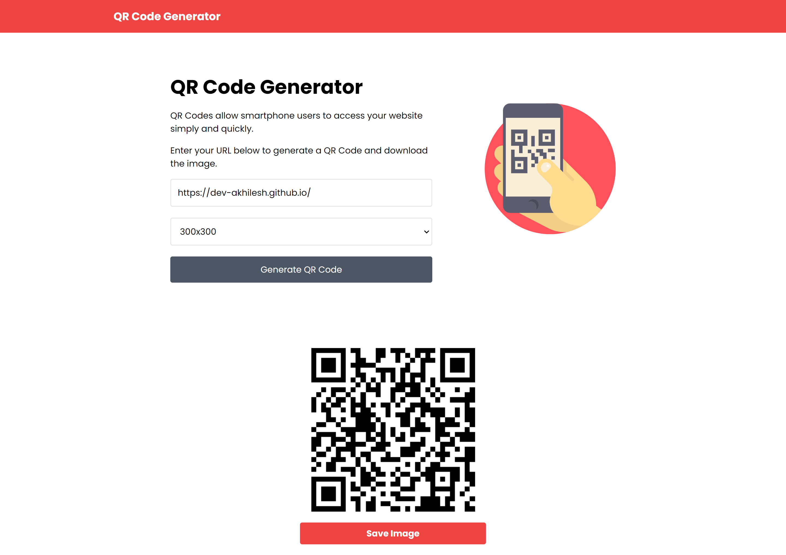

# QR Code Generator

Simple app to generate and download a QR code that can be used to share a link. This project is built using HTML, Tailwind CSS, and JavaScript.


[Live Demo](https://easyqrcodes.netlify.app/)

<div style="display: flex; justify-content: center; align-items: center;">
  
  
</div>


## Table of Contents
- [Features](#features)
- [Installation](#installation)
- [Usage](#usage)
- [Contributing](#contributing)


## Features

- Generate QR codes for any text or URL
- Download the generated QR code as an image
- Responsive design using Tailwind CSS

## Installation

1. Clone the repository:
    ```sh
    git clone https://github.com/dev-akhilesh/QR-Code-Generator
    ```
    ```sh
    cd QR-Code-Generator
    ```

2. Open `index.html` in your browser to use the QR code generator.

## Usage

1. Enter the text or URL you want to convert into a QR code in the input box.
2. Click the "Generate QR Code" button.
3. The generated QR code will be displayed.
4. Use the "Download" button to save the QR code as an image.

## Contributing

Contributions are welcome! Please follow these steps:

1. Fork the repository.
2. Create a new branch (`git checkout -b feature-branch`).
3. Make your changes and commit them (`git commit -m 'Add some feature'`).
4. Push to the branch (`git push origin feature-branch`).
5. Open a pull request.
